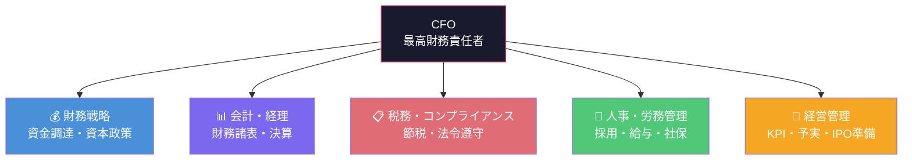

# CFOとしてのバックオフィス学習計画

> freee KB 2,424記事を活用した **起業家CFO向け 16週間カリキュラム**

---

## CFOに求められる5つの役割

---

## 全体ロードマップ

| Phase | テーマ | 期間 | CFOとしての意味 |
|:---:|---|---|---|
| 1 | 会社設立と財務基盤 | Week 1–4 | **まず会社を作り、お金の器を整える** |
| 2 | 会計・経理の実務力 | Week 5–8 | **数字を正しく記録し、読み解く力** |
| 3 | 税務戦略と資金繰り | Week 9–12 | **キャッシュを守り、増やす力** |
| 4 | 人事・労務と経営管理 | Week 13–16 | **組織を支え、成長を設計する力** |

> [!TIP]
> 各 Week は **1日2–3記事の精読 + 到達チェック** を想定。★ は最優先記事です。
>
> **継続的インプット（随時）**: `kb/「freeeトレンド」/` の344記事は法改正・制度改正の最新情報を含む。週1〜2本を選んで読む習慣を Week 1 から始めること。

---

## Phase 1: 会社設立と財務基盤（Week 1–4）

> **CFOの視点**: 法人形態・資本金・口座開設・資金調達 — 財務の土台はここで決まる

### Week 1 — 起業と法人形態の選択

| 学習項目 | 対応KB | 優先度 |
|---|---|:---:|
| 起業の全体像 | `kb/「会社設立」の基礎知識/14_起業/` | ★ |
| 株式会社 vs 合同会社 | `kb/「会社設立」の基礎知識/03_株式会社/` + `02_合同会社/` | ★ |
| 法人化のメリット・デメリット | `kb/「会社設立」の基礎知識/01_法人化（法人成り）/` | ★ |
| 個人事業主の基礎知識（法人化前の状態を理解する） | `kb/「開業」の基礎知識/05_個人事業主の基礎知識/` | ★ |
| 法人の種類 | `kb/「会社設立」の基礎知識/05_法人の種類/` | |
| 一般社団法人 | `kb/「会社設立」の基礎知識/04_一般社団法人/` | |

> [!NOTE]
> **「開業」KB（170記事）について**: このKBは個人事業主・フリーランス向けが中心だが、「法人化前の状態」を知ることで法人化の意義が具体的になる。特に `05_個人事業主の基礎知識/` は法人化の比較対象として必読。

**到達チェック**: 株式会社と合同会社の違い（設立費用・意思決定・信用力）を比較表にできる

### Week 2 — 会社設立の実務

| 学習項目 | 対応KB | 優先度 |
|---|---|:---:|
| 設立の準備・手続き | `kb/「会社設立」の基礎知識/06_会社設立の準備/` + `10_会社設立の手続き/` | ★ |
| 定款 | `kb/「会社設立」の基礎知識/11_定款/` | ★ |
| 設立にかかる費用・時間 | `kb/「会社設立」の基礎知識/07_会社設立にかかる費用/` + `08_会社設立にかかる時間/` | |
| 設立後の基礎 | `kb/「会社設立」の基礎知識/25_会社設立後の基礎知識/` | |

**到達チェック**: 設立〜登記完了までのステップを時系列で説明できる

### Week 3 — 資本金と資金調達

| 学習項目 | 対応KB | 優先度 |
|---|---|:---:|
| 資本金の決め方 | `kb/「会社設立」の基礎知識/18_資本金/` | ★ |
| 資金調達・補助金・助成金 | `kb/「会社設立」の基礎知識/19_資金調達・補助金・助成金/` | ★ |
| 創業融資 | `kb/「創業融資」の基礎知識/` | ★ |
| 事業計画書 | `kb/「会社設立」の基礎知識/17_事業計画書/` | ★ |
| 法人口座・カード | `kb/「会社設立」の基礎知識/16_法人口座・カード/` | |

**到達チェック**: 事業計画書に必要な項目を列挙し、それぞれの記載ポイントを説明できる

### Week 4 — 役員・ガバナンスと許認可

| 学習項目 | 対応KB | 優先度 |
|---|---|:---:|
| 役員 | `kb/「会社設立」の基礎知識/20_役員/` | ★ |
| 役員報酬 | `kb/「会社設立」の基礎知識/21_役員報酬/` | ★ |
| 変更登記 | `kb/「会社設立」の基礎知識/15_変更登記/` | |
| 許認可 | `kb/「許認可」の基礎知識/` | |
| 契約の基礎 | `kb/「契約」の基礎知識/` | |

**到達チェック**: 役員報酬の決め方と税務上の注意点（定期同額給与等）を説明できる

---

## Phase 2: 会計・経理の実務力（Week 5–8）

> **CFOの視点**: 財務諸表を「作れる」だけでなく「経営判断に使える」レベルにする

### Week 5 — 簿記と勘定科目

| 学習項目 | 対応KB | 優先度 |
|---|---|:---:|
| 簿記の基礎 | `kb/「会計」の基礎知識/14_簿記/` | ★ |
| 勘定科目の体系 | `kb/「勘定科目」の基礎知識/01_勘定科目の基礎知識/` | ★ |
| 仕訳帳 | `kb/「会計」の基礎知識/11_仕訳帳/` | ★ |
| 出納帳・総勘定元帳 | `kb/「会計」の基礎知識/09_出納帳/` + `08_総勘定元帳/` | |

> [!NOTE]
> **勘定科目KBは151記事と最大級のボリューム**。全記事精読は不要。自社業種でよく発生する取引（例: SaaS費用→クラウド利用料の勘定科目）を中心に引き辞書として活用すること。

**到達チェック**: 自社の主要取引を仕訳に起こせる

### Week 6 — 財務三表を読む

| 学習項目 | 対応KB | 優先度 |
|---|---|:---:|
| 決算書の全体像 | `kb/「会計」の基礎知識/03_決算書/` | ★ |
| 貸借対照表（B/S） | `kb/「会計」の基礎知識/04_貸借対照表/` | ★ |
| 損益計算書（P/L） | `kb/「会計」の基礎知識/05_損益計算書/` | ★ |
| キャッシュフロー計算書（C/F） | `kb/「会計」の基礎知識/06_キャッシュフロー計算書/` | ★ |
| 試算表 | `kb/「会計」の基礎知識/07_試算表/` | |

**到達チェック**: B/S・P/L・C/Fの三表のつながりを図示し、各指標の意味を説明できる

### Week 7 — 経理実務と月次決算

| 学習項目 | 対応KB | 優先度 |
|---|---|:---:|
| 経理業務の全体像 | `kb/「会計」の基礎知識/02_経理業務/` | ★ |
| 減価償却 | `kb/「会計」の基礎知識/15_減価償却/` | ★ |
| 法人会計の基礎 | `kb/「会計」の基礎知識/01_法人会計の基礎知識/` | |
| 会計ソフト活用 | `kb/「会計」の基礎知識/20_会計ソフト/` + `21_freee会計/` | |

**到達チェック**: 月次決算のフローと主要チェックポイントを列挙できる

### Week 8 — 請求・支払と商取引フロー

| 学習項目 | 対応KB | 優先度 |
|---|---|:---:|
| 請求書の書き方・管理 | `kb/「請求書」の基礎知識/02_請求書の書き方/` + `03_請求書の管理/` | ★ |
| インボイス制度 | `kb/「請求書」の基礎知識/01_インボイス制度/` | ★ |
| 見積書・納品書・領収書 | `kb/「請求書」の基礎知識/05_領収書/` + `06_見積書/` + `07_納品書/` | ★ |
| 電子契約・電子サイン | `kb/「サイン」の基礎知識/01_サイン/` | ★ |
| 経費精算とワークフロー | `kb/「経費精算」の基礎知識/` | |
| 受発注業務 | `kb/「受発注」の基礎知識/` | |

> [!NOTE]
> **電子契約は現代の商取引の前提**。紙の契約フローを覚えると同時に、電子サインツール（freee サイン等）を使ったデジタルワークフローを理解しておくこと。

**到達チェック**: 見積→受注→納品→請求→入金の一連フローと必要帳票を説明できる

---

## Phase 3: 税務戦略と資金繰り（Week 9–12）

> **CFOの視点**: 「知らなかった」で損をしない。キャッシュフローを最大化する税務戦略

### Week 9 — 法人税と消費税

| 学習項目 | 対応KB | 優先度 |
|---|---|:---:|
| 法人税 | `kb/「会計」の基礎知識/17_法人税/` | ★ |
| 消費税 | `kb/「会計」の基礎知識/18_消費税/` | ★ |
| 会社設立時の税金 | `kb/「会社設立」の基礎知識/22_税金/` | ★ |
| 税金の基礎知識 | `kb/「確定申告」の基礎知識/10_税金の基礎知識/` | |
| 支払調書 | `kb/「会計」の基礎知識/10_支払調書/` | |

**到達チェック**: 法人税の実効税率・消費税の免税事業者制度を説明できる

### Week 10 — 確定申告と控除

| 学習項目 | 対応KB | 優先度 |
|---|---|:---:|
| 確定申告の全体像 | `kb/「確定申告」の基礎知識/11_確定申告の基礎知識/` | ★ |
| 青色申告 | `kb/「青色申告」の基礎知識/04_青色申告の基礎知識/` | ★ |
| 控除の基礎 | `kb/「確定申告」の基礎知識/08_控除の基礎知識/` | ★ |
| 源泉徴収 | `kb/「人事労務」の基礎知識/04_源泉徴収票/` | |
| 所得税・住民税 | `kb/「人事労務」の基礎知識/08_所得税・住民税/` | |

**到達チェック**: 法人と個人の課税関係を整理し、役員報酬設計の税務的メリットを説明できる

### Week 11 — 資金繰りと財務戦略

| 学習項目 | 対応KB | 優先度 |
|---|---|:---:|
| 資金繰り改善 | `kb/「資金繰り改善」の基礎知識/` | ★ |
| 資金繰り（会計視点） | `kb/「会計」の基礎知識/12_資金繰り/` | ★ |
| 予実管理 | `kb/「会計」の基礎知識/13_予実管理/` | ★ |
| 債権・債務管理 | `kb/「債権・債務」の基礎知識/` | |

**到達チェック**: 資金繰り表を作成し、キャッシュ・コンバージョン・サイクルを説明できる

### Week 12 — 販売管理と収支の最適化

| 学習項目 | 対応KB | 優先度 |
|---|---|:---:|
| 販売管理 | `kb/「販売管理」の基礎知識/01_販売管理/` | ★ |
| 原価管理 | `kb/「販売管理」の基礎知識/02_原価管理/` | ★ |
| 収支管理 | `kb/「販売管理」の基礎知識/04_収支管理/` | |
| 工数管理 | `kb/「販売管理」の基礎知識/03_工数管理/` | |
| クレジットカード活用 | `kb/「クレジットカード」の基礎知識/` | |

**到達チェック**: 損益分岐点を計算し、利益改善施策を3つ以上提案できる

---

## Phase 4: 人事・労務と経営管理（Week 13–16）

> **CFOの視点**: 人件費は最大のコスト。採用・社保・ガバナンスを制する者がスケールを制する

### Week 13 — 給与設計と社会保険

| 学習項目 | 対応KB | 優先度 |
|---|---|:---:|
| 給与計算 | `kb/「人事労務」の基礎知識/01_給与計算/` | ★ |
| 社会保険 | `kb/「人事労務」の基礎知識/05_社会保険/` + `kb/「会社設立」の基礎知識/13_社会保険/` | ★ |
| 労働保険 | `kb/「人事労務」の基礎知識/09_労働保険/` | ★ |
| 残業代 | `kb/「人事労務」の基礎知識/07_残業代/` | |
| 福利厚生 | `kb/「福利厚生」の基礎知識/` | |

**到達チェック**: 従業員1人あたりの月額人件費（総額）を試算できる

### Week 14 — 採用・入退社と労務管理

| 学習項目 | 対応KB | 優先度 |
|---|---|:---:|
| 入退社手続き | `kb/「人事労務」の基礎知識/02_入退社/` | ★ |
| 就業規則 | `kb/「人事労務」の基礎知識/11_就業規則/` | ★ |
| 有給管理 | `kb/「人事労務」の基礎知識/06_有給管理/` | |
| 勤怠管理 | `kb/「勤怠管理」の基礎知識/` | |
| 働き方改革 | `kb/「人事労務」の基礎知識/12_働き方改革/` | |
| 人事管理 | `kb/「人事管理」の基礎知識/` | |

**到達チェック**: 初めての正社員採用に必要な届出・書類をリストアップできる

### Week 15 — 経営管理とIPO準備

| 学習項目 | 対応KB | 優先度 |
|---|---|:---:|
| 経営管理 | `kb/「経営管理」の基礎知識/` | ★ |
| IPOの基礎 | `kb/「IPO」の基礎知識/01_IPOの基礎知識/` | ★ |
| 内部統制・社内体制 | `kb/「IPO」の基礎知識/02_内部統制・社内体制の構築/` | ★ |
| 上場企業の基礎 | `kb/「IPO」の基礎知識/03_上場企業の基礎知識/` | |
| ERP | `kb/「ERP」の基礎知識/` | |

**到達チェック**: IPO準備のタイムライン（N-3〜上場）と主要マイルストーンを説明できる

### Week 16 — 業務効率化と総まとめ

| 学習項目 | 対応KB | 優先度 |
|---|---|:---:|
| 業務効率化 | `kb/「業務効率化」の基礎知識/` | ★ |
| アウトソーシング戦略 | `kb/「アウトソース」の基礎知識/` | ★ |
| プロジェクト管理の基礎 | `kb/「プロジェクト管理」の基礎知識/01_記事一覧/` | |
| 税理士との連携 | `kb/「会計」の基礎知識/19_税理士/` | |

> [!WARNING]
> **`kb/「AI活用」の基礎知識/` は現在1記事のみ**のため、このKBだけで AI 活用を学ぶのは不十分。AI活用については「補足学習」セクションの外部リソースを参照すること。

**到達チェック**: 自社の業務フローから「内製 vs 外注」の判断基準を整理できる

---

## freee KB でカバーしきれない CFO 知識（補足学習が必要）

> [!WARNING]
> 以下の領域は freee KB だけでは不十分です。別途書籍やコースでの補強を推奨します。

| 領域 | なぜ必要か | 推奨リソース |
|---|---|---|
| **ファイナンス理論** | DCF、WACC、バリュエーション | 『ざっくり分かるファイナンス』(光文社新書) |
| **資本政策・エクイティ** | 株式の希薄化、ストックオプション設計 | 『起業のファイナンス』(磯崎哲也) |
| **管理会計の応用** | KPI設計、部門別損益、SaaS Metrics | 『管理会計の基本』(日本実業出版社) |
| **会社法・契約法務** | 株主総会、取締役会、株主間契約 | 弁護士監修の実務書 or 顧問弁護士 |
| **監査対応** | 外部監査、内部監査の実務 | IPO準備段階で監査法人と連携 |
| **AI・DX活用（CFO必須）** | 経理自動化、AI仕訳、財務予測AIツール | freeeトレンドの最新記事 + 各社プロダクト公式ドキュメント |

---

## 学習のコツ（CFO目線）

> [!IMPORTANT]
> CFOは「自分で全部やる人」ではなく **「全体を理解して判断する人」** です。

1. **意思決定に使える粒度で理解する** — 仕訳の暗記より「この数字が何を意味するか」を重視
2. **税理士・社労士との会話力を磨く** — 専門家に丸投げせず、質問・判断できるレベルに
3. **自社に当てはめて考える** — 記事を読んだら「自社の場合はどうなるか」を必ず考える
4. **Phase 1 は最優先** — 会社設立・資金調達の判断ミスは後から取り返しにくい
5. **KBは「引き辞書」として使う** — 特に勘定科目（151記事）・資金繰り改善（79記事）は通読ではなく必要なときに引く。全記事を順番に読もうとしない
6. **「freeeトレンド」を継続インプットに** — 344記事の最新情報を週1〜2本ペースで読み続けることで、法改正への感度を維持する
